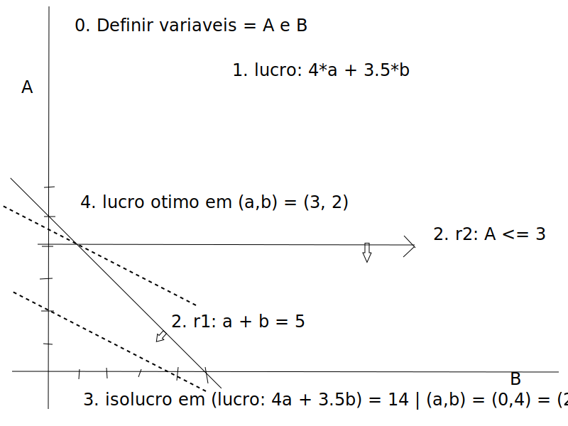

# Week 01

## Resumo 

Fases iniciais de um estudo de investigação operacional são:
 - A definição do problema, recolha de dados, desenvolvimento de um modelo matemático
 - e implementação de métodos para a sua resolução
  
Os passos principais da formulação em programação matemática são: 
 - a *definição das variáveis* do problema, *seguida da* definição do *objetivo e restrições* (estes últimos em qualquer ordem)
   
Uma expressão matemática em termos de variáveis x_1, x_2, . . . , x_n diz-se linear se, e só se:
- puder ser escrita na forma a_1 x_1 + a_2 x_2 + . . .  + a_n x_n, em que a_i são constantes
  
Uma igualdade linear em termos de variáveis x_1, x_2, . . . , x_n:
 - pode ser escrita na forma a_1 x_1 + a_2 x_2 + . . .  + a_n x_n *=* b, em que a_i e b são constantes
  
Uma desigualdade linear em termos de variáveis x_1, x_2, . . . , x_n :
 - pode ser escrita na forma a_1 x_1 + a_2 x_2 + . . .  + a_n x_n *\leq* b ou a_1 x_1 + a_2 x_2 + \ldots + a_n x_n *\geq* b, em que a_i e b são constantes
> Nota: Usamos sempre espacos infintamente diviseis, por isso nao faz sentido a restricao ser < ou > (em contrario de <= e >=)
  
Num problema de otimização linear: 
 - tenta-se *maximizar (ou minimizar) uma função* linear das variáveis de decisão, sujeito a uma série de equações ou desigualdades lineares, *em que cada variável pode assumir valores de um conjunto contínuo* especificado
  
Uma solução admissível de um problema de otimização linear:
 - satisfaz todas as restrições do problema
  
Uma linha de isocusto (isolucro) de um problema de otimização linear é um conjunto de soluções:
 - tal que a função objetivo avaliada em qualquer desses pontos tem o mesmo valor
   
Um problema de otimização linear:
 - Pode ter um número infinito de soluções
 - Pode não ter uma solução ótima única
 - Pode não ter nenhuma solução admissível
 - Pode não ter solução ótima limitada

## PL 01

1. Ex 01: Usamos computacao grafica e fazemos a programacao matematica em pl1/ex01.mod
... 0. Para fazer o primeiro exercicios, primeiro definimos as variaveis
... 1. Definimos o objectivo 
... 2. Para completarmos os graficos com as restricoes (devem ser todas lineares)
... 3. Defninmos a linha de isolucro 
... 4. Por fim deslocamos a linha de isolucro para chegar ao objectivo otimo

